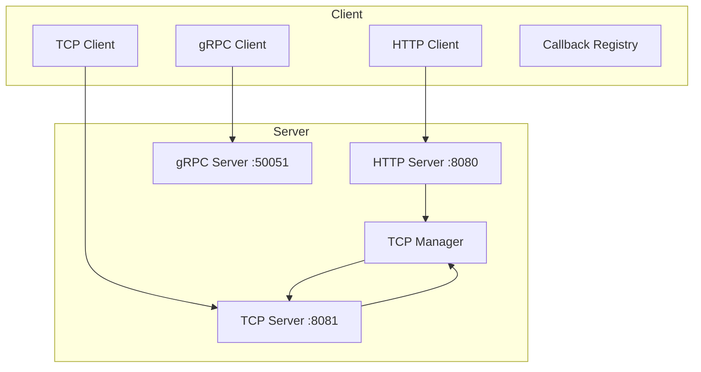
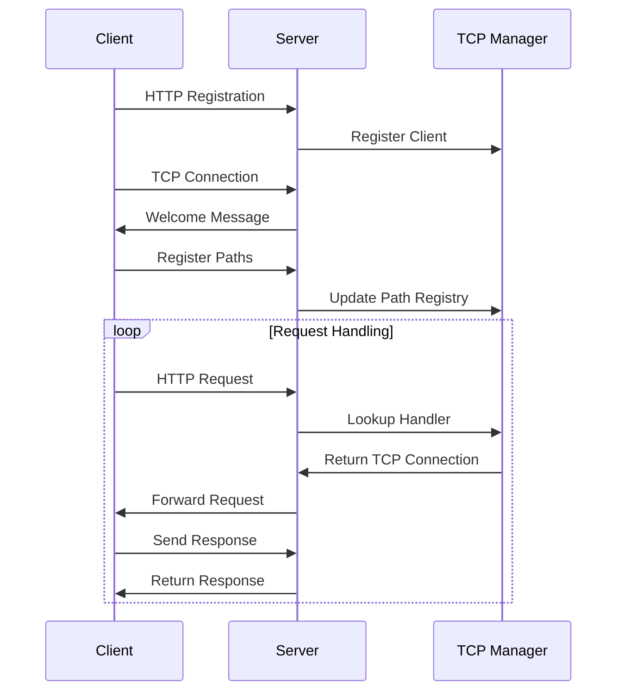

# Multichannel Communication System

A robust, multi-protocol communication system built in Go that supports HTTP, TCP, and gRPC protocols for seamless client-server interactions.

## Table of Contents
- [Overview](#overview)
- [System Architecture](#system-architecture)
- [Features](#features)
- [Prerequisites](#prerequisites)
- [Installation](#installation)
- [Usage](#usage)
- [Protocol Details](#protocol-details)
- [API Documentation](#api-documentation)
- [Implementation Examples](#implementation-examples)
- [Contributing](#contributing)
- [License](#license)

## Overview

The Multichannel Communication System is designed to provide flexible, scalable, and reliable communication between clients and servers using multiple protocols. It supports real-time bidirectional communication, automatic reconnection, and dynamic routing capabilities.

### Key Features Matrix

| Feature | HTTP | TCP | gRPC |
|---------|------|-----|------|
| Registration | ✅ | ✅ | ✅ |
| Bidirectional | ❌ | ✅ | ✅ |
| Streaming | ❌ | ✅ | ✅ |
| Auto-reconnect | ❌ | ✅ | ✅ |
| Load Balancing | ✅ | ✅ | ✅ |
| SSL/TLS | ✅ | ✅ | ✅ |

## System Architecture

### Component Diagram



### Message Flow



## Prerequisites

- Go 1.19 or higher
- Protocol Buffers compiler (protoc)
- Make (optional, for build automation)

## Installation

1. Clone the repository:
```bash
git clone https://github.com/yourusername/multichannel.git
cd multichannel
```

2. Install dependencies:
```bash
go mod download
```

3. Generate Protocol Buffers code:
```bash
protoc --go_out=. --go_opt=paths=source_relative \
    --go-grpc_out=. --go-grpc_opt=paths=source_relative \
    proto/*.proto
```

## Usage

### Starting the Server

```bash
go run main.go
```

### Running a Client

```bash
go run cmd/client/main.go
```

### Configuration Options

| Parameter | Environment Variable | Default | Description |
|-----------|---------------------|---------|-------------|
| HTTP Port | HTTP_PORT | 8080 | HTTP server port |
| TCP Port | TCP_PORT | 8081 | TCP server port |
| gRPC Port | GRPC_PORT | 50051 | gRPC server port |
| Host | SERVER_HOST | localhost | Server hostname |
| Log Level | LOG_LEVEL | info | Logging level |

## Protocol Details

### HTTP Protocol Flow

1. Client Registration
```http
POST /register
Content-Type: application/json

{
    "client_id": "unique-id",
    "paths": ["/stocks", "/weather"]
}
```

2. Request Routing
```http
GET /stocks
Host: localhost:8080
```

### TCP Message Format

```go
type TcpMessage struct {
    Sub       string          // Message type
    Msg       json.RawMessage // Payload
    RequestId int32          // Request ID
}
```

### Callback Registration

```go
// Register a callback for a specific path
callbackRegistry.Register("/stocks", func(req typedefs.Request) interface{} {
    // Handle request and return response
    return stockData
})
```

## Implementation Examples

### 1. Basic Client Setup

```go
block := &ClientBlock{
    Host: "localhost",
    HTTP: 8080,
    TCP:  8081,
    GRPC: 50051,
    Paths: []string{
        "/stocks",
        "/weather",
    },
}

// Register and start client
block.Register()
block.TcpConnect()
block.Process()
```

### 2. Custom Callback Implementation

```go
func customCallback(req typedefs.Request) interface{} {
    // Parse request
    var data map[string]interface{}
    json.Unmarshal(req.Body, &data)
    
    // Process data
    result := processData(data)
    
    // Return response
    return result
}

// Register callback
callbackRegistry.Register("/custom", customCallback)
```

## Error Handling

| Error Type | HTTP Status | TCP Message | Recovery Action |
|------------|-------------|-------------|-----------------|
| Connection Lost | 503 | ERROR | Auto-reconnect |
| Invalid Request | 400 | ERROR | Log and ignore |
| Timeout | 504 | ERROR | Retry with backoff |
| Server Error | 500 | ERROR | Alert and retry |

## Performance Considerations

### Optimization Tips

1. **Connection Pooling**
   - Maintain a pool of TCP connections
   - Reuse connections when possible
   - Implement connection lifecycle management

2. **Message Buffering**
   - Buffer messages during high load
   - Implement backpressure mechanisms
   - Use appropriate buffer sizes

3. **Resource Management**
   - Implement proper cleanup
   - Monitor memory usage
   - Use connection timeouts

### Monitoring Metrics

| Metric | Description | Warning Threshold | Critical Threshold |
|--------|-------------|-------------------|-------------------|
| Connection Count | Active TCP connections | 80% capacity | 90% capacity |
| Message Rate | Messages per second | 1000/s | 2000/s |
| Response Time | Average response time | 200ms | 500ms |
| Error Rate | Errors per minute | 5/min | 10/min |

## Contributing

1. Fork the repository
2. Create your feature branch (`git checkout -b feature/amazing-feature`)
3. Commit your changes (`git commit -m 'Add amazing feature'`)
4. Push to the branch (`git push origin feature/amazing-feature`)
5. Open a Pull Request

## License

This project is licensed under the MIT License - see the [LICENSE](LICENSE) file for details.

---

For more detailed information about specific components, please refer to:
- [Server Specification](docs/SERVER_SPEC.md)
- [Client Specification](docs/CLIENT_SPEC.md)
